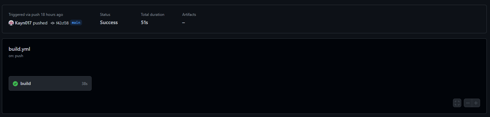
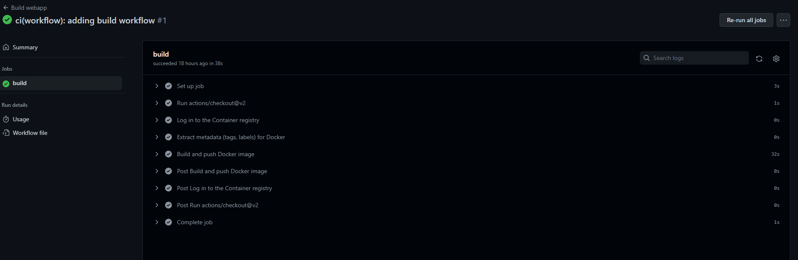
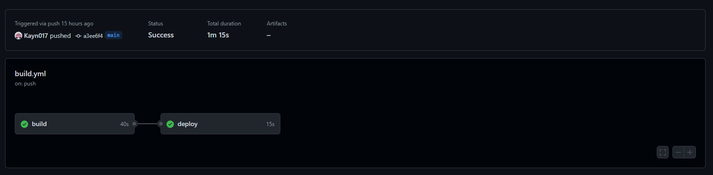
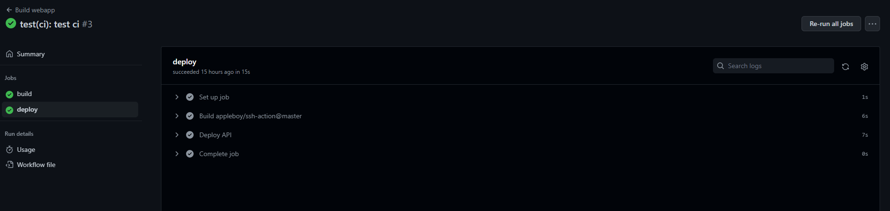

# Rendu déploiement

## I. Docker

Pour faire court, Docker c'est un plateforme permettant de lancer des mini VM nommé **container** et chaque container correspond à un service d'une projet. 
L'intêret de Docker, c'est qu'on a pas besoin de se faire chier avec des dépendances sur le système, des conflits de versions, etc etc... Tu as Docker d'installé sur ton serv et ça suffit.

Pour créer notre container , on a besoin de créer une **image** Docker. Une image, c'est en quelques sortes un modèle de container, un template.
On peut s'en servir pour créer un container (autrement dit, on lance un container à partir de l'image) ou pour créer une autre image à partir de celle ci.

Et pour créer cette image, on va utiliser le fichier Dockerfile présent à la racine du projet. Il contient toutes les instructions nécessaire à la création de notre image.

### I.1 Dockerfile

On va prendre le Dockerfile de la Webapp comme exemple. On peut déjà voir que le Dockerfile est divisé en 2 stages : une stage de **build** et une stage d'**execution**.
L'intêret de créer l'image en 2 stages, c'est déjà pour séparer les environnements de build et d'execution.
Le stage de build va servir à compiler la webapp.
Le stage d'execution va servir a délivrer la webapp compilé au client.

Déjà, regardons le stage de build

```Dockerfile
# build stage
FROM node:16-alpine AS builder

WORKDIR /opt/webapp

# config files copy
COPY package.json /opt/webapp/package.json
COPY package-lock.json /opt/webapp/package-lock.json
COPY tsconfig.json /opt/webapp/tsconfig.json
COPY tsconfig.node.json /opt/webapp/tsconfig.node.json
COPY tailwind.config.cjs /opt/webapp/tailwind.config.cjs
COPY postcss.config.cjs /opt/webapp/postcss.config.cjs
COPY vite.config.ts /opt/webapp/vite.config.ts

# install dependencies
RUN npm install

# source files copy
COPY index.html /opt/webapp/index.html
COPY src/ /opt/webapp/src/

RUN npm run build
```

Tout en haut, on a déjà l'instruction `FROM`. Elle sert à déterminer à partir de quel image on se base pour créer notre stage.
Ici, on a besoin de node pour build la webapp, on va donc se baser sur une image node. J'ai également lock la version à la version 16 pour éviter les mauvaises surprises
et j'ai pris la variante **alpine**, car c'est une image beaucoup plus légère que l'image de base.

L'instruction `AS` permet de nommer le stage dans lequel on se trouve. Ici, je précise que ce stage est le stage appelé **builder**.   
L'instruction `WORKDIR` comme son nom l'indique définit quel est le répertoire de travail. C'est l'équivalent d'un cd mais à l'intérieur de l'image docker.  
L'instruction `COPY` permet de copier un fichier de l'ordinateur vers l'image Docker (ex: COPY package.json /opt/webapp/package.json copie le fichier package.json du PC dans le fichier /opt/webapp/package.json de l'image Docker).  
L'instruction `RUN` permet de lancer une commande à l'intérieur de l'image (ex: RUN npm install va lancer la commande npm install dans l'image Docker).

Déjà rien qu'avec ça, on arrive à build la webapp. Une fois que la build passe, on passe au stage suivant, le stage d'execution, qui va définir les conditions de fonctionnement de l'image Docker.

```Dockerfile
# Execute stage
FROM nginx:alpine

# nginx conf file required to handle React router
COPY nginx.conf /etc/nginx/conf.d/default.conf
COPY --from=builder /opt/webapp/dist/ /usr/share/nginx/html/

EXPOSE 80
EXPOSE 443

CMD ["nginx", "-g", "daemon off;"]
```

On part d'une image `nginx:alpine` pour avoir un serveur web qui va délivrer la webapp compilé (variante alpine pour avoir une image plus légère 😋). On copie un fichier de conf depuis le repo (Fichier nécessaire pour gérer les routes du client).
Et après, on copie les fichiers depuis le stage précédent (le répertoire /opt/webapp/dist/) dans le stage actuel (dans le répertoire /usr/share/nginx/html/).  
Après, on voit qu'on expose les ports 80 et 443. Ca signifie que ces ports sont disponible depuis l'extérieur de l'image. 

Enfin, y'a l'instruction `CMD`. Elle sert à indiquer la commande à executer au lancement de l'image.

### I.2 Build de l'image

Une fois le Dockerfile terminé, on peut build notre image ! 😄

Pour ca, on a la commande
```sh
docker build -t <nom de limage> . # sur Linux, généralement, on rajoute "sudo" devant
```

Le `-t` sert à déterminer un nom de l'image pour le retrouver
L'argument (le .) permet de donner le contexte dans lequel on va build l'image. C'est généralement le dossier dans lequel se trouve le Dockerfile.

Une fois la commande lancée, Docker va télécharger les images nécessaires (ici, les images `node:16-alpine` et `nginx:alpine`) et lancer les instructions du Dockerfile.

Une fois que la build est passé, l'image est prête à être utilisé !

### I.3 Création d'un container

Pour lancer notre webapp, on va donc créer un container Docker à partir de l'image toute fraiche. 

Ca se fait avec la commande 
```sh
docker run --name <nom du container> -p 3000:80 -it <nom de limage> # sur Linux, généralement, on rajoute "sudo" devant
```

L'option `--name` permet de définir un nom pour notre container  
L'option `-p` permet de bind un port du container sur un port physique du host. Par exemple, ici, le port 3000 du PC va correspondre au port 80 du container.  
L'option `-it` permet de bind la console dans laquelle on lance la commande à la console du container. Ici, ca nous sert juste à pouvoir faire `CTRL + C` pour arrêter nginx (et donc, le container)

Une fois le container lancé, on peut accéder à la webapp sur l'URL **http://localhost:3000/** ! 😄

## II. Github Actions

Tout ça, c'est bien beau, mais si on est obligé de build à chaque mise en prod, ca va vite être chiant. C'est une belle perte de temps et ca serait quand même mieux d'automatiser tout ça.

Donc nous avons mis en place de la **CI/CD** pour build automatiquement l'image à chaque push sur la branche `main`.

### II.1 Keskecé la CI/CD ?

La **CI/CD** (Continuous Integration / Continuous Deployment) c'est un système qui permet d'automatiquement build une application et de la déployer en prod dans la foulée.
Pour l'instant, on va juste faire un focus sur la partie build 😎

### II.2 Build de l'image automatique

Du coup, pour tout ça, on va utiliser le système de CI de Github : **Github Actions.**

> Les fichiers pour tout ça sont dispo dans `.github/workflows`

Les fichiers yml à l'intérieur sont les pipelines Github. Une **pipeline** en CICD, c'est un ensemble d'étapes qui amènent au déploiement d'une solution.

Déjà, on voit que le fichier est délimité en plusieurs parties : 

```yml
name: Build webapp
```
Ca c'est juste le nom de la pipeline.

```yml
on:
  push:
    branches: [main]
```
Ca, ça correspond au **trigger** de cette pipeline. On peut voir ici qu'on déclenche cette pipeline à chaque push sur la branche `main`.

```yml
env:
  REGISTRY: ghcr.io
  IMAGE_NAME: ${{ github.repository }}
```
Ici, ce sont les variables d'environnement.   
Le `REGISTRY`, ca correspond à l'endroit où on va stocker notre image Docker une fois qu'elle a fini de build (ici c'est ghcr.io, le registry d'image Docker de Github)
L'`IMAGE_NAME`, c'est le nom de l'image qu'on va build. Les items entre ${{ ... }}, ce sont des variables de pipelines (a ne pas confondre avec les variables d'environnement), en l'occurence, le nom du repo

```yml
jobs:
  ..........
```
La, c'est le coeur de la pipeline, c'est ici que sont indiqué toutes les choses à faire.


Ici, je vais juste prendre le job `build`. Ca nous donne donc ceci : 

```yml
jobs:
  build:
    runs-on: ubuntu-latest

    permissions:
      contents: read
      packages: write

    steps:
      - uses: actions/checkout@v2
        with:
          submodules: recursive
      - name: Log in to the Container registry
        uses: docker/login-action@v1
        with:
          registry: ${{ env.REGISTRY }}
          username: ${{ github.actor }}
          password: ${{ secrets.GITHUB_TOKEN }}
      - name: Extract metadata (tags, labels) for Docker
        id: meta
        uses: docker/metadata-action@v3
        with:
          images: ${{ env.REGISTRY }}/${{ env.IMAGE_NAME }}
      - name: Build and push Docker image
        uses: docker/build-push-action@v2
        with:
          context: .
          push: true
          tags: ${{ steps.meta.outputs.tags }}
          labels: ${{ steps.meta.outputs.labels }}
  .................
```
Si on décortique ça, ça nous donne : 
```yml
runs-on: ubuntu-latest
```
Ici, on indique sur quel système tourne notre pipeline. En général, on privilégie une distrib linux, mais on peut avoir parfois besoin de Windows (pour du build d'appli Unity par exemple) ou de MacOS (pour des build d'appli iOS par exemple).

```yml
permissions:
      contents: read
      packages: write
```

La, on précise que notre job peut lire le contenu du repo github et écrire dans les registry de packages github.

```yml
steps:
  ............
```
La c'est toutes les étapes du job. Ca fonctionne comme ca:
```yml
- name: Log in to the Container registry
  uses: docker/login-action@v1
  with:
      registry: ${{ env.REGISTRY }}
      username: ${{ github.actor }}
      password: ${{ secrets.GITHUB_TOKEN }}
```

`name` : nom de l'étape
`uses` : nom de l'action à executer
`with` : arguments de l'action

> On peut voir parmi les variables le mot clé `secrets`. Ce sont des variables secrètes qui sont, pour certaines, généré par Github (comme c'est le cas ici) ou renseigné par les développeurs. On y met des tokens d'authentifications, des mots de passes, des adresses de serveurs etc...
Sur Ratiscrum, elles sont renseigné dans l'organisation, on peut les retrouver ici : https://github.com/organizations/Ratiscrum-V2/settings/secrets/actions

En soit, rien de bien compliqué tout ça, c'est toujours un peu le même principe ! 🙂 Ca c'est un peu les instructions de base, pour plus de détails, faut se référer à la documentation de l'action qu'on utilise.

En gros, les étapes du job de build c'est :
- on récupère le contenu du repo 
- on se log au registry pour pouvoir y déposer notre image Docker
- on extrait les métadonnées
- on build l'image et on l'envoie sur le registry github

Une fois que le workflow est setup, on peut push nos fichiers, et on peut consulter l'état de nos CI ici : https://github.com/Ratiscrum-V2/rts-app/actions




## III. Docker Compose

Revenons à nos containers Docker. Avoir pleins de containers, c'est bien, les faire fonctionner ensemble, c'est mieux 👀

Du coup, pour ça, j'ai mis en place un **Docker Compose**.

### III.1 Docker quoi ? 

Un Docker compose, c'est un fichier qui sert à orchestrer le fonctionnement général de nos containers Docker entre eux. Il sert à les lier ensemble, à les configurer ensemble, etc...
Pour Ratiscrum, j'ai créé un repo `rts-compose` qui contient le Docker compose et tout ce qu'il faut. 

### III.2 Mise en place

Du coup, notre fichier compose est découpé ainsi :

```yml
version: "3.3"
```
On indique la version de Docker Compose que l'on utilise

```yml
networks:
  web:
    external: true # traefik network
```
Ici, on indique l'existence d'un network Docker appelé `web` qui a été créé à l'extérieur du Docker Compose.
C'est une spécificité de notre serveur, qui fait tourner plusieurs Docker Compose sur un même VPS, ça permet de faire cohabiter tout ça + facilement.

```yml
services:
  ............
```

Tout les services pris en charge par le Docker Compose. Un service est constitué comme ça :
```yml
api:
  image: "ghcr.io/ratiscrum-v2/rts-api:main"
  restart: always
  networks:
    - web
  environment:
    NODE_ENV: production
    API_PORT: 80
    POSTGRES_HOST: postgres
    POSTGRES_DB: ${DB_NAME}
    POSTGRES_USER: ${DB_USER}
    POSTGRES_PASSWORD: ${DB_PASSWORD}
    POSTGRES_PORT: 5432
    JWT_SECRET_KEY: ${JWT_SECRET_KEY}
    S3_ACCESS_KEY_ID: ${MINIO_ROOT_USER}
    S3_SECRET_ACCESS_KEY: ${MINIO_ROOT_PASSWORD}
    S3_ENDPOINT: minio:9000
  labels:
  - "traefik.enable=true"
  - "traefik.http.routers.api.rule=Host(`api.${URL}`)"
  - "traefik.http.routers.api.tls=true"
  - "traefik.http.routers.api.tls.certresolver=httpsresolver"
  - "traefik.http.routers.api.entrypoints=websecure"
  - "traefik.http.services.api.loadbalancer.server.port=80"
  - "traefik.http.middlewares.cors-headers.headers.accessControlAllowOriginListRegex=(.*?)"
  depends_on:
    postgres:
      condition: service_healthy
    minio:
      condition: service_started
```

Déjà, la clé de l'objet yaml, c'est le nom du service (ici `api`)  
Le champ `image` correspond à l'image sur laquelle se base le container (ici, on lui indique l'image de l'api ratiscrum)  
Le champ `restart` indique les conditions de redémarrage de l'api (à always, ca indique de l'api va toujours redémarrer, peu importe si elle s'est arrêté à cause d'un crash, du redémarrage du serv, etc)  
Le champ `networks` indique les réseaux auquel est connecté le container (ici le réseau web)  
Le champ `environment` indique les variables d'environnements  
Le champ `labels` sert ici à indiquer au reverse proxy les règles de ce container, comme son adresse, son port d'écoute, l'utilisation du https ou encore la politique de cors. Le reverse proxy c'est Traefik et il tourne dans un autre fichier compose sur le serv  
Le champ `depends_on` indique ici sous quel condition on démarre l'api. Ici, on peut voir que l'API démarre quand le service `minio` est lancé et quand le service `postgres` est *healthy* (comprenez "utilisable", en gros).

Pour définir si un container est *healthy*, on renseigne le champ `healthcheck` :

```yml
..........
  postgres: 
    ............
    healthcheck:
      test: ["CMD", "pg_isready", "--dbname=${DB_NAME}", "--host=localhost", "--username=${DB_USER}"]
      timeout: 10s
      retries: 10
```

En gros, il va faire la commande donnée dans `test` 10 fois (le nombre qu'on a indiqué dans `retries`) et le test échoue automatiquement si le code d'erreur de la commande n'est pas 0 ou si la commande n'a pas répondu au bout de 10 secondes (la valeur indiquée dans `timeout`)

### III.3 Lancement du projet

Pour lancer maintenant ce Docker Compose, on va lancer la commande :
```sh
docker compose -f docker-compose.yml --env-file .env up # /!\ "docker-compose" sous linux et "docker compose" sous windows
```

> Le fichier .env doit avoir été renseigné.

Le Docker Compose va se charger de tout le reste !

### III.4 Déploiement du Docker Compose

Maintenant, on a plus qu'a déployer tout ça ! Et, tant qu'à faire, on va automatiser tout ça ! 😄

J'ai donc mis en place une Github Actions sur le repo `rts-compose` qui va donc se charger de déployer le fichier docker compose sur le serveur à chaque changement.

> Le déploiement se fait dans le dossier `/home/ratiscrum/prod` du serveur.

## IV. Déploiement des services

Maintenant qu'on a notre CI, on peut reprendre nos pipelines pour qu'après avoir build, elles déploient automatiquement le changement sur le serveur.  
Pour cela, c'est assez simple : reprenons notre pipeline sur la webapp.

On y ajoute un nouveau job, appelé `deploy`. 
On garde la même structure, mais on rajoute une propriété 
```yml
needs: build
```

Cette propriété indique que l'on ne fait ce job qu'après que le job `build` est terminé sans erreur.
Ensuite on ajoute un job `ssh-action` qui va executer des commandes à distance sur le serveur de prod. 

```yml
steps:
  - name: Deploy API
    uses: appleboy/ssh-action@master
    with:
        host: ${{ secrets.SERVER_ADRESS }}
        username: ${{ secrets.SSH_USER }}
        key: ${{ secrets.SSH_PRIVATE_KEY }}
        port: 22
        script: |
        cd prod
        docker-compose -f docker-compose.yml pull webapp
        docker-compose -f docker-compose.yml stop webapp
        docker-compose -f docker-compose.yml rm -f webapp
        docker-compose -f docker-compose.yml --env-file ./.env up -d webapp
```

Si l'on regarde les commandes à éxecuter, 

1. On se met dans le dossier de prod
2. On récupère l'image du service webapp
3. On stop le container webapp actuellement en route
4. On le supprime
5. On le relance (à partir de la nouvelle image qu'on a récupérer au préalable)

et voilà 😄 Maintenant, à chaque push sur `main`, une fois la build passé, la nouvelle version d'une container va être déployé sur le serveur ! 

Maintenant, y'a plus qu'à coder, tout le reste, l'infra s'occupe de déployer 😎 


